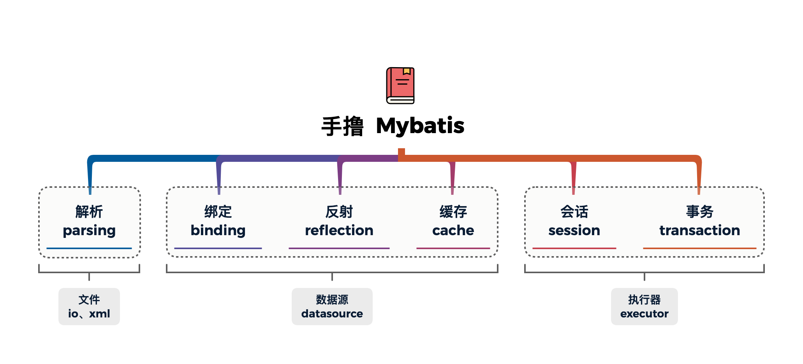
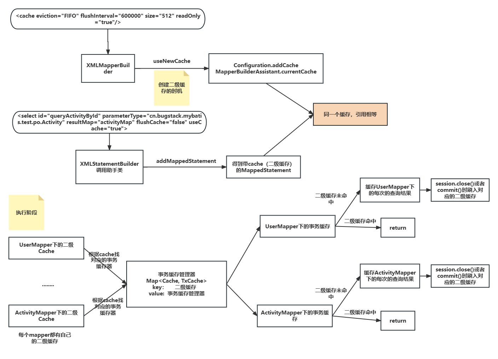

<div align="center">
<h1>Small-MyBatis-ext</h1>
</div>
<div align="center">


</div>


## 1 介绍
手写Mybatis Framework核心, 并**拓展了新功能**



MyBatis框架麻雀虽小，五脏俱全。包含十几种设计模式，通过学习源码，是快速提升编程能力的有效途径。MyBatis是一款优秀的框架，并且它再适合不过那些刚刚尝试阅读一些框架源码的小伙伴们。

本项目，从`mybatis-config.xml`以及`mapper.xml`解析到数据源，事务，Mapper的动态代理，动态sql解析，执行器，结果封装，插件 等等，完整的把MyBatis的核心实现了一遍，**并在此基础上对本项目实现的MyBatis做了一些实用的拓展。**

如：**数据库的分表功能**、**慢sql日志记录功能**、**内置分页**等等。


下面详细介绍各个功能的使用方式。

## 2 数据库分表功能

1 Mapper.xml添加如下配置

```xml
<mapper namespace="com.zyh.mybatisframework.xx.dao.IActivityDao">

    <dbRouter size="4" format="%03d" join="_"/>
    
</mapper>
```

**`size`** : 多少张数据表

**`format`** : 表的命名方式(数字部分)

**`join`** :  表名和数字部分的连接方式。


2 DAO/Mapper接口的方法上添加@TableSelect注解

```java
public interface IActivityDao {

    @TableSelect(key = "activityId")
    Activity queryActivityById(Activity activity);

    List<Activity> queryActivity();

}
```

**`key`** : 路由key, 根据key确定访问数据库的位置

**`activityId`** : Activity的属性

以上注解表明key的值来自Activity的`activityId`属性。根据`activityId`路由到指定的数据库位置。


3 效果

```
21:08:46.843 [main] INFO  c.z.m.s.defaults.DefaultSqlSession - 执行查询 statement：com.zyh.mybatisframework.test.dao.IActivityDao.queryActivityById parameter：{"activityId":100001}
21:08:46.864 [main] INFO  c.z.m.executor.CachingExecutor - 原始sql : SELECT activity_id, activity_name, activity_desc, create_time, update_time
        FROM activity 
         where activity_id = ?
21:08:46.864 [main] INFO  c.z.m.executor.CachingExecutor - 路由表索引 : 0
21:08:46.864 [main] INFO  c.z.m.executor.CachingExecutor - 最终执行的sql : SELECT activity_id, activity_name, activity_desc, create_time, update_time
        FROM activity_000 
         where activity_id = ?
21:08:47.054 [main] INFO  c.z.m.d.pooled.PooledDataSource - Created connection 624271064.
21:08:47.064 [main] INFO  c.z.m.s.d.DefaultParameterHandler - 根据每个ParameterMapping中的TypeHandler设置对应的参数信息 value：100001
{"activityDesc":"测试活动000","activityId":100001,"activityName":"test11","createTime":1628424890000,"updateTime":1628424890000}
```


## 3 慢sql日志记录功能

1 配置开启慢sql功能，慢sql的阈值、输出文件位置等信息

```xml
<settings>
    <setting name="slowSqlEnabled" value="true"/>
    <setting name="slowSqlLogPath" value="xxxx/xx.txt"/>
    <setting name="slowSqlTimeLimit" value="2000"/>
</settings>
```


## 4 内置分页插件使用方式

1 配置开启分页功能

```xml
<settings>
    <setting name="pageSeger" value="default"/>
</settings>
```

或者也可以配置分页插件

```xml
<plugins>
    
   <plugin interceptor="com.zyh.mybatisframework.plugin.impl.page.PagePlugin"/>
    
</plugins>
```

二选一


2 查询前紧跟startPage方法

```java
PageSeger.startPage(int currentPage, int size);
```


3 示例代码

```java
// ...
SqlSession sqlSession01 = sqlSessionFactory.openSession();
IActivityDao dao01 = sqlSession01.getMapper(IActivityDao.class);

PageSeger.startPage(2, 5);
List<Activity> activities = dao01.queryActivity();

System.out.println(JSON.toJSONString(activities));
System.out.println(activities.size()); // 5
```


## 5 手写MyBatis实现过程

### 1. Configuration

**`SqlSessionFactory.build(Reader reader)`**

**核心步骤**：

1. xml -> IO流 : 

   ​	核心就是去类路径下加载xml的配置文件，并转换成 `Reader` 字符流

2. XMLConfigBuilder.parse()

`XMLConfigBuilder` 是 `BaseBuilder`的子类

`XMLConfigBuilder` 解析 `mybatis-config.xml`文件

目前**仅仅**解析了\<configuration>里面的\<mappers>标签

```xml
 <configuration>
 
     <mappers>
         <mapper resource="mapper/User_Mapper.xml"/>
     </mappers>
 
 </configuration>
```

并通过解析Mapper标签的resource属性找到对应的`User_Mapper.xml`文件

继续解析`User_Mapper.xml`文件， 完成 注册Mapper映射器 和 [select|insert|update|delete]封装成一个MappedStatement对象的工作。

1. 解析后给Configuration的属性赋值。

所以, 目前仅有的属性有mappedStatements（带占位符的sql语句 和 参数值）以及 mapperRegistry（找到代理工厂 -> 进一步找到代理类）

> **Configuration的作用**
>
> Configuration是所用XML文件中配置的数据解析后并存放的位置，可以理解为Mybatis执行的环境。
>
> 后续DefaultSqlSession的构造函数传入Configuration, 获取Mapper相关信息

**---------------------------step04 add--------------------------**

1. TypeAliasRegistry 类型别名注册机

别名注册机管理的是

基本类型、数组类型 -> 具体的对象类型 

> 在 TypeAliasRegistry 类型别名注册器中先做了一些基本的类型注册，以及提供 registerAlias 注册方法和 resolveAlias 获取方法。

1. step03解析mapper后, step04新增解析数据源配置的功能

Environment包括 **数据源** 和 **事务管理器**

通过在 XML 解析器 XMLConfigBuilder 中，扩展对环境信息的解析，我们这里把数据源、事务类内容称为操作 SQL 的环境。解析后把配置信息写入到 Configuration 配置项中，便于后续使用。


**---------------------------step08 add--------------------------**

进一步细化xml的解析：step08以前，xml的解析工作都在`XMLConfigBuilder`一个类中完成，太过于冗余。

step08把解析工作拆分

`XMLConfigBuilder` : 解析mybatis-config.xml的配置，其中mappers的解析交给`XMLMapperBuilder`的来实现。


`XMLMapperBuilder` : 负责找到所有的mappers, 并且简单的解析最外层的<mapper namespace="org.mybat

is.example.BlogMapper">后，其内部的内容如：\<select>标签属性交给`XMLStatementBuilder`来完成.


`XMLStatementBuilder` : 其中的`parseStatementNode()`方法解析【select|update】标签的属性，其内部

的原生sql如：`select * from t_user where id = #{id}`交给XML语言驱动器来完成.


`XMLLanguageDriver`: 其中的`createSqlSource()`方法去解析\<select>标签里面的最原始的sql（带\<if>,带#{}的sql），包装成`SqlSource`对象，并封装到`MappedStatement`中，添加到`Configuration`里面。

包装成`SqlSource`对象是交给`XMLScriptBuilder` 来完成的。


`XMLScriptBuilder` ： 解析SQL, 目前就是静态SQL, 后期这里会拓展解析动态SQL的功能


`RawSqlSource` ： 静态的SqlSource, 递归解析sql（静态sql只需要拼接就好）, 把原生SQL解析成只带#{} ${}的sql语句


`SqlSourceBuilder` : #{} -> ? 代替 ， 返回SqlSource.


`SqlSource`： `SqlSource`中包含 只含？的sql，以及List\<ParameterMapping> parameterMappings,

在parameterMappings存储了所有？占位符应该被替换的参数信息。

> 后面执行sql的时候， 需要BoundSql里面带？的sql语句 和 参数值


**--------------------------------step15 add-----------------------------------**

**动态sql解析**

1. 解析xml封装动态节点

   > 封装成一个List\<SqlNode> ， 一个sql被切割成几个部分，有静态文本类型和MixSqlNode类型。 每个动态标签都会被解析成MixSqlNode, MixSqlNode包含IfNode等等动态类型sql节点。 在解析成文本类型的时候会去掉${}这种符号


2. 将动态sql节点拼接为可执行的sql(只带?占位符的sql)的时机是在执行的时候调用了getBoundSql() 

```java
 executor.query(ms, parameter, RowBounds.DEFAULT, Executor.NO_RESULT_HANDLER, ms.getSqlSource().getBoundSql(parameter));
```

动态节点对象解析递归 拼接成只含 #{}的sql 字符串，不替换 #{} 这种参数

**动态节点的解析流程**

整个是一个递归解析的过程， 分为了静态文本节点，Mix混合节点（是一个sql节点的集合，里面包含了动态节点和静态文本节点），遇到静态文本节点，直接拼接节点的内容，遇到Mix节点继续递归。整个就是一个DFS过程。

DFS的退出条件：

**静态文本节点：** 直接拼接节点的内容

**SET, IF节点：** 1. 根据OGNL表达式判断，test属性的值的真假，决定是否添加

​			 2. 前缀后缀的处理操作。

【拓展学习】：

**Where节点：** 


**了解怎么知道参数的类型处理器。**

不管是引用类型还是配置了ResultMap, 都会封装成一个ResultMap的映射对象，在ResultMap中保存了所有的对象的映射，包括参数类型，对应的jdbc类型，javaType类型。

在给参数设置值的时候会根据参数类型找对应的TypeHandler（策略模式的体现），调用TypeHandler的setParameter方法。


#### **BoundSql的来源和作用**

**BoundSql的来源**

实例化：RawSqlSource 在构造函数中去解析动态标签，把动态标签去掉，只剩下#{}的sql

ParameterMappingTokenHandler & GenericTokenParser 解析sql 把 #{} -> ? 代替得到仅包含?占位符的sql语句。并且得到所有参数的参数映射ParameterMapping,{property,javaType=int,jdbcType=

NUMERIC}


**作用**：

实例化 PreparedStatementHandler 需要BoundSql

PreparedStatementHandler 会去实例化 参数处理器 和 结果处理器。

1. 参数处理器 需要BoundSql

> 参数处理器拿到BoundSql的ParameterMappings一个一个参数类型去找对应的类型处理器，调用	ps.setLong(parameter),ps.setString(parameter)等去除sql的占位符，得到可执行的sql。

2. 结果处理器 根据查询的结果得到每个column的java class类型

> 根据class类型找对应的typeHandler，相当于当用rs.getLong()，rs.getString()。

​	


`ParameterMapping` : 参数对象。包含property属性如：uid=? 的uid, javaType如：int , jdbcType如：NUMERIC 


**---------------------------step11 add--------------------------**

**添加\<insert> \<update> \<delete> 的解析**

首先在 XML 映射器构建器中，扩展 XMLMapperBuilder#configurationElement 方法，添加对 insert/update/delete 的解析操作。这部分不需要太多的处理，只要添加上解析类型，就能满足当前章节的诉求。同样这里的解析信息都会存放到 Configuration 配置项的映射语句Map集合 mappedStatements 中，供后续 DefaultSqlSession 执行SQL获取配置信息时使用。

**---------------------------step12 add--------------------------**

**添加注解解析**

```xml
<mappers>
    <!-- XML 配置 -->
    <mapper resource="mapper/User_Mapper.xml"/>

    <!--注解配置-->
    <mapper class="cn.bugstack.mybatis.test.dao.IUserDao"/>
</mappers>
```

XMLConfigBuilder通过mapper标签的class属性不为空，便找到这是一个注解配置的mapper

1. configuration.addMapper()

在addMapper()中调用MapperAnnotationBuilder的parse()解析注解

2. MapperAnnotationBuilder.parse()

- 获取该接口下的所有方法，并过滤桥接方法。
- 获取方法的参数类型（User.class）并且获取语言驱动器
- 根据注解的value="sql", 参数类型，语言驱动器生成SqlSource
- 调用助手类mapperBuilderAssistant新增一个MappedStatement


**ResultMap的作用**

- 如果是select类型的SQL，还需要解析方法的返回值类型，并使用MapperBuilderAssistant将返回值类型包装成ResultMap对象注入Configuration的resultMaps集合 
- 调用助手类MapperBuilderAssistant将所有的信息封装成映射器语句对象MappedStatement

Select标签的结果参数配置，一种是ResultMap ( `-返回值类型` 结尾)，一种是ResultType( `-Inline` 结尾).

但是不管怎么都会转换成ResultMap。


在DefaultResultSetHandler的handleResultSets中利用到了ResultMap

**`type`属性**: 通过反射创建对象， 后面创建元对象，方便赋值

**`mappedColumns`属性：** ResultMap中配置的一个一个的\<property>映射，通过这个来找到元对象的属性，找到setter方法，完成赋值。


**LanguageDriver的作用**


**MapperBuilderAssistant 的作用**

帮助构建MappedStatement

在这个类中封装了入参和出参的映射、以及把这些配置信息写入到 Configuration 配置项中。


**--------------------------------step13 add-----------------------------------**

**解析和使用ResultMap映射参数配置**

将数据库中user表字段user_name转为User对象实体中的userName

**解析**

（1） 解析\<mapper>的子标签\<ResultMap>

（2） 解析一个一个的\<result> 属性转换关系， 并找到属性对应的类型转换器，存放在ResultMapping对象。将ResultMapping对象存放在ResultMap中

（3） 调用 MapperBuilderAssistant.addResultMap 存放到Configuration中

**使用**

（4） 解析\<select> | \<update> 的子属性resultMap = "resultMapId"， 根据resultMap的属性id值找到Configuration中的ResultMap对象，给MappedStatement.resultMaps属性赋值。

> **MappedStatement.resultMaps属性为什么是一个resultMap的集合？**
>
> ​	因为在mapper.xml中我们可以配置多个ResultMap关系映射，并且在\<select | update>标签中，我们也可以为这条sql语句配置多个结果映射，比如我们查询的是一个User对象和一个Dept对象，我们就可以配置两个ResultMap，一个是User的属性映射，一个是Dept对象的映射。
>
> ​	不过一般一个足够了。

（5） DefaultResultSetHandler.handleResultSets() 获取从MappedStatement获取结果映射，把ResultSetWrapper结果根据映射设置到对象中。

（5） 对未映射的属性进行自动匹配，并给结果对象赋值

（6） 对映射的属性进行匹配，通过ResultMapping拿到TypeHandler 并给结果对象赋值

**疑问**：**怎么知道哪些字段需要被映射？**

> 从数据库查出来的ResultSetMetaData中解析

**--------------------------------step14 add-----------------------------------**

解析\<insert>标中的\<selectKey>标签，并构建成一个MappedStatement

如果是insert语句，还会去执行keyGenerator.processAfter()方法。


**--------------------------------step16 add-----------------------------------**

1. **解析\<plugins>标签**，存入到Configuration中的InterceptorChain 。

2. **创建四大组件的时候**Executor, StatementHandler, ParameterHandler, ResultsetHandler

   **都会调用InterceptorChain的pluginAll()**

   pluginAll的过程是不断判断需不需要生成代理的过程。

   因为有四个地方（Executor, StatementHandler, ParameterHandler, ResultsetHandler）都调用了pluginAll()方法，但是具体的我们需要生成的代理我们自己实现的接口上的注解定义好的。

   如果是我们想要代理的对象，那么就会生成一个代理对象，否则不做处理。

   >如果为一个接口配置了多个插件。
   >
   >插件的调用链： C -> B -> A -> 原生A -> 原生B -> 原生C

3. 当调用生成的这个代理对象的任何方法，都会进入这个**代理对象的invoke方法中**，但我们并不是对整个接口的所有方法增强，我们还在注解中配置了需要拦截的方法。所以在invoke方法中**判断是不是我们注解中配置的方法**

   1. 如果是，进入我们拦截器的intercept方法，执行完自定义的逻辑后，再放行。所谓的放行就是去执行我们想要拦截的方法。
   2. 如果不是，直接放行就是去执行我们想要拦截的方法。


###  2. 创建SqlSessionFactory

**`new DefaultSqlSessionFactory(Configuration config);`**

根据解析出来的Configuration对象来创建SqlSessionFactory


【**疑问**】：为什么需要Configuration参数来创建SqlSessionFactory对象呢？

因为现在Configuration中保存了我们的mapperRegistry，通过mapperRegistry找到代理工厂，进一步找到代理类。

调用链：

> Configuration -> MapperRegistry -> knowMappers -> 根据IUserDao.class找到代理工厂 -> 工厂创建代理类


### 3. 获取映射器对象

**`sqlSession.getMapper(IUserDao.class);`**

调用链：

> SqlSession -> Configuration -> MapperRegistry -> knowMappers -> 根据IUserDao.class找到代理工厂 -> 工厂创建代理类


### 4. 执行SQL

**`userDao.queryUserInfoById("10001");`**

因为返回的是代理对象，因此会去执行代理类（实现了InvocationHandler）的invoke()方法

在invoke()方法中会掠过Object的方法，这些方法我们没有必要代理。


【**疑问**】：为什么需要MapperMethod？ 又为什么MapperMethod的execute方法需要sqlSession参数呢？

1. MapperMethod是对不同类型的SQL语句的一个抽象，在代理类中，我们只需要一行代码就可以了，处理交给MapperMethod。
2. SqlSession是真正执行SQL的地方，这里定义了所有和数据库打交道的方法，所以execute需要sqlSession参数。


调用链：

> IUserDao.query() -> MapperProxy.invoke() -> MapperMethod.execute(**`sqlSession`**, args) -> sqlSession的[select|insert|update|delete]方法。


**---------------------------step04 add--------------------------**

#### SQL执行和结果封装

在step03中在 DefaultSqlSession#selectOne 只是打印了 XML 中配置的 SQL 语句，现在把数据源的配置加载进来以后，就可以把 SQL 语句放到数据源中进行执行以及结果封装。

step04中 关于 SQL 的执行、参数传递和结果封装都是写死的，后续再进行扩展。


**---------------------------step06 add--------------------------**

如果SQL执行的流程（建立连接，准备SQL语句，传入占位符参数， 执行sql, 结果封装）统统放在SqlSession中

完成的话，就太过于耦合，不利于拓展。要知道参数处理和结果集的封装是非常复杂的逻辑，放在一块不合适。

因此，SqlSession中只定义标准的方法入口， 具体的执行交给Executor执行器完成。并且SQL执行的过程被拆分

成三大元器件来处理。

> Executor执行器、StatementHandler语句处理器、ResultSetHandler结果集处理器。

#### Executor执行器

##### 模板模式

因为，执行器具有多样性，BaseExecutor定义标准的执行SQL流程， 具体执行过程的实现交给不同的子类去完成。

> 总结： 封装不变的，变化的交给子类。

执行器依赖语句处理器和结果集处理器。


#### StatementHandler语句处理器

获取statement

```
 Statement stmt = StatementHandler.prepare(connection);
```

处理sql的参数

```
 StatementHandler.parameterize(stmt);
```

#### ResultSetHandler结果集处理器

目前一行一行的处理结果，后期改进。

```
 resultSetHandler.handleResultSets(ps);
```


**---------------------------step09 add--------------------------**

**处理sql的参数**

step09之前处理sql的参数是硬编码的

```java
ps.setLong(1, Long.parseLong(((Object[]) parameterObject)[0].toString()));
```

现在利用策略模型找到对应的参数处理器，处理参数。


参数处理器的初始化时机：

 ```java
StatementHandler handler = configuration.newStatementHandler(this, ms, parameter, resultHandler, boundSql);
 ```

处理参数时机：

```java
StatementHandler.parameterize(stmt);
```

在这里调用ParameterHandler的setParameters方法，

循环调用setParameter参数，给?占位符设置具体的参数， setParameter方法是ps.setXxxx的抽象。它存在TypeHandler策略接口。


**获取具体的参数处理器步骤：**

获取具体的参数处理器是根据xml中配置的属性值来确定的，

从ParameterMapping属性封装对象 传入 参数类型属性值（java.lang.Long.class）给

`TypeHandlerRegistry`找到对应的参数处理器， 最后调用统一的setParameter方法设置参数。

> 所有的参数处理器一般是由一个工厂来管理，在mybatis里面是交给TypeHandlerRegistry类型注册机来管
>
> 理。里面有一个TYPE_HANDLER_MAP的Map对象，存储着所有的类型对应的类型处理器，调用对应的
>
> getLong()、getString()方法取得结果。


**---------------------------step10 add--------------------------**

**处理sql执行结果**

step10以前是通过先取一条记录，然后在对记录的每个列做解析。通过反射找到对应的set方法，给类型实例化的对象上赋值。但是set传入的参数类型有很多种，写if else判断是不现实的。这样做不利用拓展。


**ResultMap**

返回类型可以是通过 resultType 配置，也可以使用 resultMap 进行处理，而无论使用哪种方式其实最终都会被封装成统一的 ResultMap 结果映射类。

`ResultMapping` 和 ParameterMapping一样

包括 每一个字段的映射信息，包括：colum、javaType、jdbcType 等


TypeHandler 添加getResult()方法， 根据不同的参数类型获取不同的TypeHandler，调用getResult()获取sql执行结果。

**去哪里根据不同的参数类型获取对应的TypeHandler呢?** 

> 一般是由一个工厂来管理，在mybatis里面是交给TypeHandlerRegistry类型注册机来管理。里面有一个
>
> TYPE_HANDLER_MAP的Map对象，存储着所有的类型对应的类型处理器，调用对应的getLong()、
>
> getString()方法取得结果。


**---------------------------step11 add--------------------------**

对 MapperMethod 映射器方法的改造，在前面我们只是处理了 MapperMethod#execute 中 SELECT 类型的语句，这一章节需要在这里扩展 INSERT、DELETE、UPDATE，同时还需要对 SELECT 进行扩展查询出多个结果集的方法。

**疑问：** 为什么update不用传递sqlBound参数？

> 传也可以，不传也可以，都是去mappedStatement中重新获取SqlSource, 进而拿到BoundSql。 只是加载的顺序不同，一个先一个后。


**---------------------------step17 add--------------------------**

**一级缓存的实现**

一级缓存：关于 Mybatis 框架一级缓存的使用，主要在于一次 Session 会话周期内，将相同的执行语句结果缓存起来，避免重复执行数据库操作。当发生一切影响 Session 会话的操作时，都会清空缓存，避免发生脏读。关于缓存的配置解析以及会话生命周期内缓存的使用设计。


**1 解析一级缓存标签**

```xml
<settings>
    <!--缓存级别：SESSION/STATEMENT-->
    <setting name="localCacheScope" value="SESSION"/>
</settings>
```

解析缓存的级别，并添加到Configuration中。以后从Cofiguration中取这个缓存级别。


**2 缓存的实现**

**`DefaultSqlSessionFactory.openSession`**时，会创建SimpleExecutor, 在SimpleExecutor中包含一个一级缓存对象的属性，会在构造函数中new出来，完成创建和初始化工作，后续调用SimpleExecutor的query方法就会在不同的时机（查询，提交，回滚）去维护缓存的状态。

> 一级缓存和SimpleExecutor是绑定的。

*缓存实现原理*：

HashMap

`key`: 缓存Key   	 `value`: 查询结果list

主要方法

putObject()

getObject()

本质就是操作map


**3 执行==查询==时，先从缓存取。**

**（1） 创建缓存Key**

缓存Key的创建，需要依赖于；mappedStatementId + offset + limit + SQL + queryParams + environment 信息构建出一个哈希值，所以这里把这些对应的信息分别传递给 cacheKey#update 方法。

最后生成的key包括哈希值以及sql、参数等信息，【如下】：

```
-33520480:1090465577:cn.bugstack.mybatis.test.dao.IActivityDao.queryActivityById:0:2147483647:SELECT activity_id, activity_name, activity_desc, create_time, update_time
FROM activity 
where activity_id = ?:100001:development
```

**（2） 根据缓存Key去缓存查询**

1 queryStack==0 并且 这条sql的\<select>标签上(会转化成MappedStatement对象)配置了`flushCache=true`

```xml
<select id="selectByActivity" resultMap="activityMap" useCache="true" flushCache="true" >
    select * from activity
    where id=#{id} and activity_name = #{activityName};
</select>
```

则需要清空缓存。`flushCache=true` 表示任何时候语句被调用，都会去清空本地缓存和二级缓存。

2 根据cacheKey从localCache中查询数据

  if : 查询结果为空  then : 去数据库查询

  if : 查询结果不为空  then : 直接返回结果，不用再访问数据库

3 如果一级缓存级别为STATEMENT, 则清空缓存。下一次同样的查询仍然去数据库查

> 默认的一级缓存级别为SESSION, 只有关闭Session会话后才清空一级缓存

**（3） 清空一级缓存的时机**

commit, close, 执行update都会清空缓存中的数据。


**4 一级缓存的问题**

一级缓存只在一个Session会话中有效，不同SqlSession中不能共享一级缓存。

> 那么当一个Session将另外一个Session正在读取的记录，正在读取的Session并不会感知，还是读取的旧数据。


**---------------------------step18 add--------------------------**

**1 解析二级缓存标签**

```xml
<settings>
    <!-- 全局缓存：true/false -->
    <setting name="cacheEnabled" value="true"/>
    <!--缓存级别：SESSION/STATEMENT-->
    <setting name="localCacheScope" value="STATEMENT"/>
</settings>
```

解析缓存的级别，并添加到Configuration中。

默认启用缓存，cacheEnabled = true， 但是mapper中不配置具体的缓存的话，没有配cache标签的话，是不会

```xml
<cache type="FIFO"></cache>
```

使用到二级缓存的。


**2 二级缓存的创建时机**

（1）创建时机

在解析mapper上配置的cache标签时，会创建二级缓存实例，并且往Configuration中添加cache实例，key是

mapper的命名空间，value是cache二级缓存。

> 二级缓存是和mapper绑定的。每个被代理的mapper都有自己的二级缓存。


（2）实现原理

本质也是一个HashMap。

**put操作**:  暂存在一个事务缓存上，这个事务缓存放的是该会话下的查询条件和对应的查询结果。

*什么时候刷入二级缓存？*

> 当sqlSession.close()的时候，所以在一次会话中的多次查询是不会走二级缓存的。只有close()一下，把第一次的结果刷新到二级缓存中，下次查询二级缓存中才有东西可查。


**3 执行==查询==时，先从二级缓存取。**

**（1） 生成缓存Key**

<u>二级缓存Key的创建和一级缓存一样</u>，需要依赖于；mappedStatementId + offset + limit + SQL + queryParams + environment 信息构建出一个哈希值，所以这里把这些对应的信息分别传递给 cacheKey#update 方法。

最后生成的key包括哈希值以及sql、参数等信息，【如下】：

```
-33520480:1090465577:cn.bugstack.mybatis.test.dao.IActivityDao.queryActivityById:0:2147483647:SELECT activity_id, activity_name, activity_desc, create_time, update_time
FROM activity 
where activity_id = ?:100001:development
```

**（2） 根据缓存Key先去二级缓存查询**

1 拿到该mapper的二级缓存

2 没有配置二级缓存，直接走一级缓存逻辑

3 从该二级缓存下尝试取数据

4 二级缓存为空，走一级缓存的逻辑

5 查询结果暂存到事务缓存管理器中， 等到后面sqlSession.close()的时候刷新到二级缓存中


**（3） 清空二级缓存的时机**

配置了flushCache, 每次查询前都会清空缓存，相当于每次去数据库查询。


**4 二级缓存的问题**

联表查询会有问题。【参考美团技术团队】

> 联表查询时，当更新其中一张表的数据，对于当前链表查询的命名空间是无感的。因此，查询出来的是旧数据。

参考资料：

[聊聊MyBatis缓存机制 - 美团技术团队 (meituan.com)](https://tech.meituan.com/2018/01/19/mybatis-cache.html)





## 6 新功能实现方式

### 6.1 慢SQL日志记录

（1）解析XML

```xml
<settings>
    <setting name="slowSqlEnabled" value="true"/>
    <setting name="slowSqlLogPath" value="showSql.txt"/>
    <setting name="timeLimit" value="2000"/>
</settings>
```

添加到Configuration对象中，便于读取。

（2）`SlowSqlLoggerPlugin`插件实现

```java
@Intercepts({@Signature(type = Executor.class, method = "query",
        args = {MappedStatement.class, Object.class, RowBounds.class, ResultHandler.class})})
public class SlowSqlLoggerPlugin implements Interceptor {
    @Override
    public Object intercept(Invocation invocation) throws Throwable {
        long start = System.currentTimeMillis();
        try {
            return invocation.proceed();
        }finally {
            Object[] args = invocation.getArgs();
            MappedStatement ms = (MappedStatement) args[0];
            Object objectParameter = args[1];
            Configuration configuration = ms.getConfiguration();
            String filePath = configuration.getSlowSqlLogPath();
            int timeLimit = configuration.getSlowSqlTimeLimit();

            long end = System.currentTimeMillis();
            long executorResult = end - start;
            if (executorResult > timeLimit) {
                try (FileWriter writer = new FileWriter(filePath, true)) {
                    writer.write("一条慢sql: " + ms.getBoundSql(objectParameter).getSql() + " 执行时间: "+ executorResult +"ms\n");
                } catch (IOException e) {
                    e.printStackTrace();
                }
            }
        }
    }
}
```


（3）使用

检查是否setting中配置开启了此功能 `slowSqlEnabled`

如果为真

```java
public void setSlowSqlEnabled(Boolean enabled) {
    slowSqlEnabled = enabled;
    if(slowSqlEnabled){
        this.addInterceptor(new SlowSqlLoggerPlugin());
    }
}
```

在拦截器链中添加慢sql日志拦截器。


### 6.2 内置简单分页插件

（1）仿造PageHelper插件，在分页的查询前需跟上

```java
PageSeger.startPage(2, 5);
```

表示当前页和页面大小

（2）startPage会保存一个Page对象到ThreadLocal中，便于存取。

```java
 protected static final ThreadLocal<Page> LOCAL_PAGE = new ThreadLocal<>();


    protected static void setLocalPage(Page page) {
        LOCAL_PAGE.set(page);
    }

    public static Page getLocalPage() {
        return LOCAL_PAGE.get();
    }

    public static void clearPage() {
        LOCAL_PAGE.remove();
    }

    public static Page startPage(int pageNum, int pageSize) {
        Page page = new Page(pageNum, pageSize);
        setLocalPage(page);
        return page;
    }
}
```

（3）分页拦截器核心

```java
@Intercepts(
        @Signature(type = StatementHandler.class, method = "prepare", args = {Connection.class})
)
public class PagePlugin implements Interceptor {

    @Override
    public Object intercept(Invocation invocation) throws Throwable {
        Page page = PageSeger.getLocalPage();
        useMetaObject(invocation, page);
        try {
            return invocation.proceed();
        }finally {
            PageSeger.clearPage();
        }
    }
    
    private void useMetaObject(Invocation invocation, Page page) throws Throwable {
        StatementHandler statementHandler = (StatementHandler) invocation.getTarget();
        BoundSql boundSql = statementHandler.getBoundSql();
        if (Objects.nonNull(page)) {
            int total = getTotalSize(statementHandler, (Connection) invocation.getArgs()[0]);
            MetaObject metaObject = SystemMetaObject.forObject(boundSql);
            if (total <= 0) {
                String sql = "select * from (select 0 as id) as temp where id > 0";
                metaObject.setValue("sql", sql);
                metaObject.setValue("parameterMappings", Collections.emptyList());
                metaObject.setValue("parameterObject", null);
            } else {
                page.calculate(total);
                boolean limitExist = boundSql.getSql().trim().toLowerCase().contains("limit");
                if (!limitExist) {
                    String sql = boundSql.getSql() + " limit " + (page.getCurPage() - 1) * page.getPageSize() + ", " + page.getPageSize();
                    metaObject.setValue("sql", sql);
                }
            }
        }
    }
```

拦截StatementHandler的prepare方法，

修改sql语句，拼接上诸如： `limit 2, 5` 语句。

然后放行，执行sql。

最后把线程中的本地变量清空，防止内存溢出。


### 6.3 分表

1.xml配置

config.xml

```xml
    <plugins>
        <plugin interceptor="com.zyh.mybatisframework.plugin.impl.tableselect.DynamicMybatisPlugin"/>
    </plugins>
```

mapper.xml

```xml
<dbRouter size="4" format="%03d" join="_"/>
```


2.xml解析

```java
 dbRouterElement(element.element("dbRouter"));
```

```java
private void dbRouterElement(Element context) {
    if (context == null) return;
    Integer size = Integer.valueOf(context.attributeValue("size"));
    String format = context.attributeValue("format");
    String join = context.attributeValue("join");
    DBRouter dbRouter = new DBRouter(size, format, join);
    builderAssistant.setDBRouter(dbRouter);
}
```

```java
mappedStatementBuilder.dbRouter(router);
```

解析后的DBRouter对象和当前的MappedStatementBuilder对象绑定。


3.插件生成代理

获取注解上路由的属性值， hash后取余决定路由到哪张表

获取sql，修改sql访问的表

放行，执行sql.

